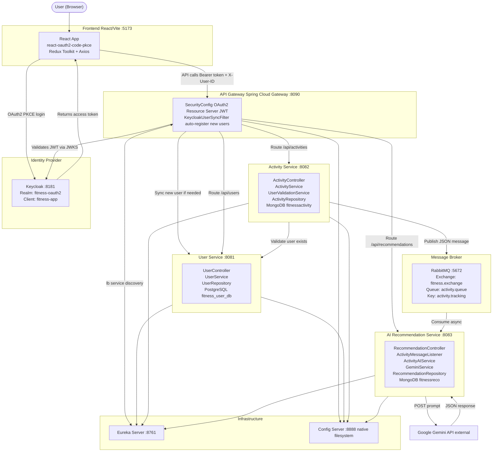

# Fitness Tracker — AI-Powered Fitness Application

A full-stack microservices application that allows users to log workouts, track calories burned and duration, and receive personalized AI-generated fitness recommendations powered by the Google Gemini API.

---

## Table of Contents

1. [Project Overview](#project-overview)
2. [Technology Stack](#technology-stack)
3. [Architecture](#architecture)
4. [Services](#services)
5. [Authentication — Keycloak + OAuth2 PKCE](#authentication--keycloak--oauth2-pkce)
6. [Asynchronous Processing — RabbitMQ](#asynchronous-processing--rabbitmq)
7. [Feature List](#feature-list)
8. [API Reference](#api-reference)
9. [Data Flow Walkthroughs](#data-flow-walkthroughs)
10. [Configuration Reference](#configuration-reference)
11. [Running the Project Locally](#running-the-project-locally)
12. [Environment Variables](#environment-variables)
13. [Project Extension Guide](#project-extension-guide)
14. [Project Structure](#project-structure)

---

## Project Overview

### What Problem Does It Solve?

People who exercise regularly often struggle to get meaningful feedback on their workouts. Standard fitness apps can log data, but do not explain *why* a session was effective or suggest *what* to do next. This application addresses that gap by combining activity logging with a live AI analysis pipeline.

### What Does It Do?

1. A user logs a workout (type, duration, calories burned).
2. The activity is saved to MongoDB.
3. The saved activity is immediately published to a RabbitMQ message queue.
4. The AI Recommendation Service consumes that message, constructs a detailed prompt, and calls the Google Gemini API.
5. Gemini's JSON response is parsed into structured sections: overall analysis, improvements, next-workout suggestions, and safety guidelines.
6. The structured recommendation is saved to MongoDB and becomes available to the frontend.
7. The user can view recommendations on the Activity Detail page or the dedicated AI Coach page.

### Why Microservices?

The application separates concerns across independent services:

| Decision | Reason |
|---|---|
| Separate User Service | User data (PostgreSQL, structured) is independent from activity data (MongoDB, document-oriented). |
| Separate Activity Service | Activity logic (CRUD + RabbitMQ publish) can evolve independently from user management. |
| Separate AI Service | The AI pipeline (Gemini API calls, response parsing, recommendation storage) is isolated and can be swapped or extended without touching other services. |
| API Gateway | A single entry point for the React frontend avoids CORS complexity across multiple ports and centralises JWT validation. |
| Config Server | One place to manage all service configurations (ports, database URIs, RabbitMQ credentials, Gemini keys) without rebuilding services. |
| Eureka | Services discover each other by logical name (`USER-SERVICE`, `ACTIVITY-SERVICE`, `AI-SERVICE`) rather than hard-coded IPs, enabling load-balanced WebClient calls. |

---

## Technology Stack

### Frontend

| Technology | Version | Purpose |
|---|---|---|
| React | 19 | UI framework |
| Vite | 6 | Build tool and dev server |
| Material UI (MUI) | 6 | Component library |
| React Router | 7 | Client-side routing |
| Redux Toolkit | 2 | Global auth state management |
| Axios | 1.8 | HTTP client with request interceptors |
| react-oauth2-code-pkce | 1.22 | OAuth2 Authorization Code + PKCE flow |
| Lucide React | 1.30 | Icon library |

### Backend

| Technology | Version | Purpose |
|---|---|---|
| Java | 21 | Language |
| Spring Boot | 3.4.3 | Application framework |
| Spring Cloud Gateway | 2024.0.0 | Reactive API gateway |
| Spring Cloud Netflix Eureka | 2024.0.0 | Service registry and discovery |
| Spring Cloud Config | 2024.0.0 | Centralised configuration |
| Spring Data JPA + Hibernate | — | PostgreSQL ORM (User Service) |
| Spring Data MongoDB | — | MongoDB ODM (Activity and AI Services) |
| Spring AMQP (RabbitMQ) | — | Asynchronous messaging |
| Spring Security OAuth2 Resource Server | — | JWT validation at the Gateway |
| WebClient (Spring WebFlux) | — | Reactive HTTP calls between services |
| Lombok | — | Boilerplate reduction |
| Nimbus JOSE + JWT | — | JWT parsing inside the Gateway filter |

### Infrastructure

| Technology | Purpose |
|---|---|
| Keycloak | Identity Provider (OAuth2 / OpenID Connect) |
| PostgreSQL | Relational database for the User Service |
| MongoDB | Document database for activities and recommendations |
| RabbitMQ | Message broker between Activity Service and AI Service |
| Google Gemini API | Large language model for recommendation generation |

---

## Architecture



### Port Map

| Service | Port |
|---|---|
| Keycloak | 8181 |
| Config Server | 8888 |
| Eureka Server | 8761 |
| API Gateway | 8090 |
| User Service | 8081 |
| Activity Service | 8082 |
| AI Recommendation Service | 8083 |
| React Frontend | 5173 |
| RabbitMQ (AMQP) | 5672 |
| PostgreSQL | 5432 |
| MongoDB | 27017 |

---

## Services

### Frontend (React + Vite)

**Location:** `fitness-app-frontend/`

The frontend is a single-page application built with React 19 and Vite. Authentication uses the OAuth2 Authorization Code flow with PKCE, handled entirely by the `react-oauth2-code-pkce` library.

#### Application Routing

| Route | Component | Description |
|---|---|---|
| `/` | Redirects to `/dashboard` | — |
| `/dashboard` | `DashboardPage` | Stats, activity form, recent activities, latest AI insight |
| `/activities` | `ActivitiesPage` | Full list of all logged activities |
| `/activities/:id` | `ActivityDetail` | Single activity with full AI recommendation |
| `/ai-coach` | `AICoachPage` | All recommendations for the current user |
| `/profile` | `ProfilePage` | User profile from Keycloak token claims |

#### State Management

Redux Toolkit manages a single slice — `authSlice` — holding the Keycloak access token, decoded token data, and the Keycloak `sub` claim (the user's application-level ID). State is persisted to `localStorage` to survive page refreshes.

```
store/
  store.js        <- configureStore with auth reducer
  authSlice.js    <- setCredentials (from Keycloak token), logout
```

#### API Communication

All API calls go through a single Axios instance in `src/services/api.js`. A **request interceptor** automatically attaches:
- `Authorization: Bearer <token>` — the Keycloak JWT
- `X-User-ID: <sub>` — the Keycloak subject UUID

Base URL: `http://localhost:8090/api` (the API Gateway)

```javascript
// Exported API functions
getActivities()                   // GET    /api/activities
addActivity(activity)             // POST   /api/activities
deleteActivity(id)                // DELETE /api/activities/:id
getActivityDetail(id)             // GET    /api/recommendations/activity/:id
getUserRecommendations(userId)    // GET    /api/recommendations/user/:userId
```

#### Dashboard Statistics

The `StatsGrid` component computes three values **client-side** from the loaded activity list (no dedicated stats API exists):
- **Total Activities** — count of all activities
- **Total Calories** — sum of `caloriesBurned` across all activities
- **Active Minutes** — sum of `duration` across all activities

---

### API Gateway

**Location:** `gateway/`  
**Port:** `8090`

Built on Spring Cloud Gateway (Spring WebFlux — reactive/non-blocking). It is the sole entry point for all frontend requests.

#### Routing Configuration

Defined in Config Server at `config/api-gateway.yml`:

| Route ID | Predicate | Upstream |
|---|---|---|
| `user-service` | `Path=/api/users/**` | `lb://USER-SERVICE` |
| `activity-service` | `Path=/api/activities/**` | `lb://ACTIVITY-SERVICE` |
| `ai-service` | `Path=/api/recommendations/**` | `lb://AI-SERVICE` |

The `lb://` prefix causes Spring Cloud Gateway to resolve service addresses through Eureka.

#### Security (SecurityConfig.java)

All routes require a valid JWT. The gateway is an **OAuth2 Resource Server** that validates tokens using Keycloak's JWKS URI:

```
http://localhost:8181/realms/fitness-oauth2/protocol/openid-connect/certs
```

CORS is configured to allow `http://localhost:5173` with headers `Authorization`, `Content-Type`, and `X-User-ID`.

#### KeycloakUserSyncFilter — Auto-Registration

A reactive `WebFilter` that runs on every authenticated request. It ensures every Keycloak user also exists in the User Service's PostgreSQL database.

Steps on each request:

1. Extract the `Authorization: Bearer <token>` header.
2. Parse the JWT locally using Nimbus JOSE to extract: `sub`, `email`, `given_name`, `family_name`.
3. Call `GET /api/users/{sub}/validate` on the User Service via load-balanced WebClient.
4. If user does **not** exist: call `POST /api/users/register` with the extracted details.
5. If user **already** exists: skip registration.
6. Mutate the request to inject `X-User-ID: <sub>` before forwarding downstream.

> **Note:** The password stored during auto-registration is a placeholder string (`dummy@123123`). The application uses Keycloak as the sole authentication authority; this placeholder is never used for login.

---

### User Service

**Location:** `userservice/`  
**Port:** `8081`  
**Database:** PostgreSQL — `fitness_user_db`, table `users`

#### Data Model — User Entity

```
Table: users
  id           UUID (PK, auto-generated)
  email        VARCHAR (unique, not null)
  keycloakId   VARCHAR
  password     VARCHAR (not null — placeholder from sync filter)
  firstName    VARCHAR
  lastName     VARCHAR
  role         ENUM (USER) — default USER
  createdAt    TIMESTAMP (auto)
  updatedAt    TIMESTAMP (auto)
```

#### REST Endpoints

| Method | Path | Description |
|---|---|---|
| `POST` | `/api/users/register` | Create user or return existing by email (idempotent) |
| `GET` | `/api/users/{userId}` | Get user profile by internal PostgreSQL UUID |
| `GET` | `/api/users/{userId}/validate` | Returns `true` if a user with that `keycloakId` exists |

> The `userId` path variable in `/validate` is matched against the `keycloakId` column (the Keycloak `sub`), not the internal UUID. All inter-service calls use the Keycloak subject ID.

---

### Activity Service

**Location:** `activityservice/`  
**Port:** `8082`  
**Database:** MongoDB — `fitnessactivity`, collection `activities`

#### Data Model — Activity Document

```
Collection: activities
  _id              String (ObjectId)
  userId           String  (Keycloak sub)
  type             Enum (ActivityType)
  duration         Integer (minutes)
  caloriesBurned   Integer (kcal)
  startTime        LocalDateTime (optional)
  metrics          Map<String, Object> (optional additional metrics)
  createdAt        LocalDateTime (auto via @CreatedDate)
  updatedAt        LocalDateTime (auto via @LastModifiedDate)
```

**ActivityType enum:** `RUNNING`, `WALKING`, `CYCLING`, `SWIMMING`, `WEIGHT_TRAINING`, `YOGA`, `HIIT`, `CARDIO`, `STRETCHING`, `OTHER`

#### REST Endpoints

| Method | Path | Header | Description |
|---|---|---|---|
| `POST` | `/api/activities` | `X-User-ID` | Track a new activity |
| `GET` | `/api/activities` | `X-User-ID` | List all activities for the user |
| `GET` | `/api/activities/{activityId}` | — | Get a single activity by ID |
| `DELETE` | `/api/activities/{activityId}` | `X-User-ID` | Delete activity (ownership enforced) |

#### User Validation

Before saving any activity, `UserValidationService` makes a synchronous WebClient call to `http://USER-SERVICE/api/users/{userId}/validate`. The WebClient is `@LoadBalanced` — Eureka resolves `USER-SERVICE`.

#### RabbitMQ Publishing

After saving to MongoDB, the activity is published:

```
Exchange:    fitness.exchange  (DirectExchange, durable)
Routing Key: activity.tracking
Queue:       activity.queue    (durable)
```

Serialised to JSON via `Jackson2JsonMessageConverter`. Publishing is wrapped in try/catch — if RabbitMQ is unavailable the failure is logged but the save is not rolled back.

---

### AI Recommendation Service

**Location:** `aiservice/`  
**Port:** `8083`  
**Database:** MongoDB — `fitnessreco`, collection `recommendations`

#### Data Model — Recommendation Document

```
Collection: recommendations
  _id            String (ObjectId)
  activityId     String  (source activity ID)
  userId         String  (Keycloak sub)
  activityType   String
  recommendation String  (full text: overall + pace + heartRate + calories sections)
  improvements   List<String>
  suggestions    List<String>
  safety         List<String>
  createdAt      LocalDateTime
```

#### Message Consumption (ActivityMessageListener)

```java
@RabbitListener(queues = "activity.queue")
public void processActivity(Activity activity) {
    Recommendation rec = aiService.generateRecommendation(activity);
    recommendationRepository.save(rec);
}
```

#### Prompt Construction (ActivityAIService)

`createPromptForActivity()` builds a prompt with activity type, duration, calories, and additionalMetrics. It instructs Gemini to respond with this exact JSON schema:

```json
{
  "analysis": {
    "overall": "...",
    "pace": "...",
    "heartRate": "...",
    "caloriesBurned": "..."
  },
  "improvements": [
    { "area": "...", "recommendation": "..." }
  ],
  "suggestions": [
    { "workout": "...", "description": "..." }
  ],
  "safety": ["...", "..."]
}
```

`processAiResponse()` navigates `candidates[0].content.parts[0].text`, strips markdown code fences, parses the JSON, and maps it into the `Recommendation` model. If parsing fails, `createDefaultRecommendation()` returns a safe fallback.

#### Gemini Integration (GeminiService)

```
POST ${GEMINI_API_URL}?key=${GEMINI_API_KEY}
Content-Type: application/json
Body: { "contents": [{ "parts": [{ "text": "<prompt>" }] }] }
```

#### REST Endpoints

| Method | Path | Description |
|---|---|---|
| `GET` | `/api/recommendations/user/{userId}` | All recommendations for a user |
| `GET` | `/api/recommendations/activity/{activityId}` | Recommendation for a specific activity |

---

### Config Server

**Location:** `configserver/`  
**Port:** `8888`  
**Profile:** `native` (reads from `classpath:/config`)

Manages all microservice configurations from YAML files in the project filesystem (not a Git repository).

| Config File | Service | Configures |
|---|---|---|
| `config/api-gateway.yml` | API Gateway | Port 8090, JWKS URI, routes, Eureka URL |
| `config/user-service.yml` | User Service | Port 8081, PostgreSQL datasource, JPA, Eureka URL |
| `config/activity-service.yml` | Activity Service | Port 8082, MongoDB URI, RabbitMQ, queue names, Eureka URL |
| `config/ai-service.yml` | AI Service | Port 8083, MongoDB URI, RabbitMQ, Gemini env vars, Eureka URL |

Each service bootstraps with:

```yaml
spring:
  config:
    import: optional:configserver:http://localhost:8888
```

The `optional:` prefix means services start even if the Config Server is unreachable, falling back to their own `application.yml`.

---

### Eureka Server

**Location:** `eureka/`  
**Port:** `8761`

Standard Spring Cloud Netflix Eureka server. Does not register itself (`register-with-eureka: false`, `fetch-registry: false`).

All four microservices register as Eureka clients, enabling:

1. Load-balanced routing at the Gateway (`lb://USER-SERVICE`, `lb://ACTIVITY-SERVICE`, `lb://AI-SERVICE`)
2. Load-balanced WebClient calls from Activity Service to User Service
3. Load-balanced WebClient calls from the Gateway's sync filter to the User Service

Eureka dashboard: `http://localhost:8761`

---

## Authentication — Keycloak + OAuth2 PKCE

### Keycloak Configuration

| Setting | Value |
|---|---|
| Keycloak URL | `http://localhost:8181` |
| Realm | `fitness-oauth2` |
| Client ID | `fitness-app` |
| Client Type | Public (no client secret) |
| Flow | Authorization Code + PKCE |
| Scopes | `openid profile email offline_access` |
| Redirect URI | `http://localhost:5173` |

### OAuth2 PKCE Flow Step by Step

```
1. User clicks "Sign In"
       |
2. react-oauth2-code-pkce generates:
     code_verifier  = random string
     code_challenge = BASE64URL(SHA-256(code_verifier))
       |
3. Browser redirects to Keycloak:
   /auth?client_id=fitness-app
        &redirect_uri=http://localhost:5173
        &response_type=code
        &scope=openid profile email offline_access
        &code_challenge=<hash>
        &code_challenge_method=S256
       |
4. User logs in at Keycloak
       |
5. Keycloak redirects back: http://localhost:5173?code=<auth_code>
       |
6. Library POSTs to Keycloak /token:
     code=<auth_code>
     code_verifier=<original random string>
     grant_type=authorization_code
       |
7. Keycloak returns: access_token, id_token, refresh_token
       |
8. Token + decoded tokenData stored in Redux + localStorage
       |
9. Every API request includes:
     Authorization: Bearer <access_token>
     X-User-ID:     <sub from tokenData>
```

**Token Refresh:** When the refresh token expires, `onRefreshTokenExpire` calls `event.logIn()` to re-authenticate.

### Why PKCE?

The frontend is a **public client** — there is no server-side component and no client secret. Without PKCE, an intercepted authorization code could be exchanged for tokens by an attacker. PKCE binds the token exchange to the original `code_verifier`, which never leaves the browser.

### JWT Validation at the Gateway

On every request the Gateway:
1. Reads the `Authorization: Bearer <token>` header.
2. Fetches Keycloak's public keys from the JWKS URI (cached after first fetch).
3. Validates signature, expiry, issuer, and audience.
4. Returns `401 Unauthorized` if validation fails.

Downstream services do **not** validate JWTs — they trust the `X-User-ID` header injected by the Gateway.

---

## Asynchronous Processing — RabbitMQ

### Why Asynchronous?

Calling the Gemini API is a network-bound operation that takes time. Doing this synchronously would force the user to wait several seconds after logging an activity. RabbitMQ decouples the two operations:

- The Activity Service saves the activity and responds **immediately**.
- The AI Service generates the recommendation **in the background**.

### Message Configuration

```
Exchange:    fitness.exchange   (Direct, durable)
Queue:       activity.queue     (durable)
Routing Key: activity.tracking
```

Both the Activity Service (publisher) and AI Service (consumer) declare identical exchange/queue/binding beans in their respective `RabbitMqConfig.java` files.

### Message Serialisation

`Jackson2JsonMessageConverter` with `TypePrecedence.INFERRED` — the AI Service deserialises messages directly into its `Activity` model class without relying on type metadata headers.

### Message Flow

```
ActivityService.trackActivity()
  1. activityRepository.save(activity)         -> MongoDB
  2. rabbitTemplate.convertAndSend(            -> RabbitMQ publish
         "fitness.exchange",
         "activity.tracking",
         savedActivity)
  3. return ActivityResponse to client         -> immediate 200 response

                 (asynchronous, background)

ActivityMessageListener.processActivity(activity)   @RabbitListener
  4. ActivityAIService.generateRecommendation(activity)
       a. createPromptForActivity()            -> build prompt string
       b. GeminiService.getAnswer(prompt)      -> POST to Gemini REST API
       c. processAiResponse()                  -> parse JSON, build Recommendation
  5. recommendationRepository.save(rec)        -> MongoDB
```

---

## Feature List

### Implemented Features

**Authentication**
- OAuth2 Authorization Code + PKCE flow via Keycloak
- Automatic token refresh on expiry
- Logout clears Redux state, localStorage, and Keycloak session
- Profile page displays name, email, and user ID from JWT claims

**User Auto-Registration**
- First login automatically registers the user in the User Service via `KeycloakUserSyncFilter`
- Subsequent logins detect the existing user and skip registration

**Activity Tracking**
- Log activities with: type, duration (minutes), calories burned (kcal)
- `startTime` and `additionalMetrics` fields exist in the backend model and are accepted; the frontend form does not expose UI for them
- 10 supported activity types

**Activity Management**
- View all activities for the authenticated user
- View individual activity detail
- Delete activity (ownership enforced server-side)
- Loading skeletons, error states with retry, success/error snackbars

**AI Recommendations**
- Asynchronous recommendation generation on every new activity
- Structured output: overall analysis, improvements, next-workout suggestions, safety guidelines
- Fallback default recommendation if Gemini call or JSON parsing fails
- Per-activity recommendation on Activity Detail page
- All recommendations on the AI Coach page
- Latest recommendation preview on Dashboard

**Dashboard**
- Summary stats: total activities, total calories, total active minutes (computed client-side)
- Inline activity tracking form
- Recent activities list
- Latest AI recommendation card

**Infrastructure**
- Centralised configuration via Spring Cloud Config Server (native/filesystem mode)
- Service discovery via Eureka (all four backend services register)
- Load-balanced inter-service HTTP calls via `@LoadBalanced` WebClient
- Reactive non-blocking API Gateway (Spring WebFlux)

### Limitations and Honest Notes

| Item | Status |
|---|---|
| Stats API endpoint | Not implemented — stats are computed client-side from the full activity list |
| Activity update (PUT/PATCH) | Not implemented — activities can only be created or deleted |
| `additionalMetrics` UI | Backend accepts it; frontend form does not expose it |
| Keycloak realm setup | Manual — no automated provisioning script or realm export included |
| Docker Compose | Not included in the repository |
| `UserRole` in access control | The `USER` enum value is defined but not enforced in any authorization logic |

---

## API Reference

All requests go through the API Gateway: `http://localhost:8090`

Every authenticated request must include:
```
Authorization: Bearer <access_token>
X-User-ID:     <keycloak_sub>
```

### User Service — /api/users

#### POST /api/users/register

Called internally by the Gateway filter. Returns the existing user if already registered (idempotent by email).

**Request Body:**
```json
{
  "email": "user@example.com",
  "password": "placeholder",
  "keycloakId": "550e8400-e29b-41d4-a716-446655440000",
  "firstName": "Jane",
  "lastName": "Doe"
}
```

**Response:**
```json
{
  "id": "internal-postgres-uuid",
  "keycloakId": "550e8400-e29b-41d4-a716-446655440000",
  "email": "user@example.com",
  "firstName": "Jane",
  "lastName": "Doe",
  "createdAt": "2025-01-15T10:30:00",
  "updatedAt": "2025-01-15T10:30:00"
}
```

#### GET /api/users/{userId}

Returns user profile by internal PostgreSQL UUID.

#### GET /api/users/{userId}/validate

Returns `true` if a user with `keycloakId = {userId}` exists, `false` otherwise.

---

### Activity Service — /api/activities

#### POST /api/activities

**Request Body:**
```json
{
  "type": "RUNNING",
  "duration": 45,
  "caloriesBurned": 380,
  "startTime": "2025-01-15T07:00:00",
  "additionalMetrics": {}
}
```

**Response:**
```json
{
  "id": "67a1b2c3d4e5f6789abc1234",
  "userId": "550e8400-e29b-41d4-a716-446655440000",
  "type": "RUNNING",
  "duration": 45,
  "caloriesBurned": 380,
  "startTime": "2025-01-15T07:00:00",
  "additionalMetrics": {},
  "createdAt": "2025-01-15T07:45:12",
  "updatedAt": "2025-01-15T07:45:12"
}
```

#### GET /api/activities

Returns all activities for the authenticated user (filtered by X-User-ID). Response is an array of activity objects.

#### GET /api/activities/{activityId}

Returns a single activity by MongoDB document ID.

#### DELETE /api/activities/{activityId}

Returns `204 No Content`. Returns an error if the activity's `userId` does not match the `X-User-ID` header.

---

### AI Recommendation Service — /api/recommendations

#### GET /api/recommendations/activity/{activityId}

Returns the AI recommendation for a specific activity. Returns an error if no recommendation has been generated yet.

**Response:**
```json
{
  "id": "67b2c3d4e5f678901abc2345",
  "activityId": "67a1b2c3d4e5f6789abc1234",
  "userId": "550e8400-e29b-41d4-a716-446655440000",
  "activityType": "RUNNING",
  "recommendation": "Overall: Your 45-minute run demonstrates solid cardiovascular effort...\n\nPace: ...\n\nHeart Rate: ...\n\nCalories: ...",
  "improvements": [
    "Cadence: Increase your step rate to approximately 170-180 steps per minute",
    "Breathing: Practice diaphragmatic breathing to improve oxygen efficiency"
  ],
  "suggestions": [
    "Tempo Run: A 20-minute run at 80% max effort to build speed endurance",
    "Recovery Jog: An easy 30-minute run at conversational pace to promote recovery"
  ],
  "safety": [
    "Always warm up with 5 minutes of light jogging before each run",
    "Stay hydrated — aim for 400-600ml of water per 30 minutes of exercise",
    "Cool down and stretch your quads, hamstrings, and calves after each session"
  ],
  "createdAt": "2025-01-15T07:45:25"
}
```

#### GET /api/recommendations/user/{userId}

Returns all recommendations for the user as an array, in the order stored by MongoDB.

---

## Data Flow Walkthroughs

### Flow 1: First Login

```
1.  User clicks "Sign In"
2.  react-oauth2-code-pkce redirects to Keycloak with PKCE code_challenge
3.  User authenticates at Keycloak
4.  Keycloak redirects back to http://localhost:5173?code=<auth_code>
5.  Library exchanges code + code_verifier for tokens (no client secret)
6.  AuthContext provides token and tokenData (decoded JWT payload)
7.  App.jsx dispatches setCredentials -> Redux state + localStorage updated
8.  AuthenticatedApp renders; first API call triggers the Gateway filter
9.  KeycloakUserSyncFilter intercepts the request
10. Filter parses JWT locally to extract sub, email, given_name, family_name
11. Filter calls GET /api/users/{sub}/validate via load-balanced WebClient
12. User Service returns false (not yet registered)
13. Filter calls POST /api/users/register with JWT claim data
14. User Service saves user to PostgreSQL with keycloakId = sub
15. Filter injects X-User-ID header and forwards original request downstream
```

### Flow 2: Logging an Activity

```
1.  User fills ActivityForm: type=RUNNING, duration=45, caloriesBurned=380
2.  addActivity() -> POST http://localhost:8090/api/activities
    Headers: Authorization: Bearer <token>, X-User-ID: <sub>
3.  Gateway validates JWT -> OK
4.  Gateway routes to lb://ACTIVITY-SERVICE (Eureka resolves address)
5.  ActivityController sets request.userId = X-User-ID header value
6.  ActivityService.trackActivity(request):
    a. UserValidationService: GET http://USER-SERVICE/api/users/{id}/validate -> true
    b. Activity built and saved to MongoDB (fitnessactivity)
    c. Saved Activity published to RabbitMQ (fitness.exchange, activity.tracking)
    d. ActivityResponse returned
7.  Gateway returns 200 to frontend
8.  Frontend shows "Activity tracked successfully!" snackbar
9.  refreshKey incremented -> ActivityList re-fetches

(Background - asynchronous):
10. ActivityMessageListener receives message from activity.queue
11. ActivityAIService.generateRecommendation(activity):
    a. createPromptForActivity() -> builds structured prompt string
    b. GeminiService.getAnswer(prompt) -> POST to Gemini API
    c. Gemini returns JSON response inside candidates[0].content.parts[0].text
    d. processAiResponse() strips markdown fences, parses JSON schema
    e. Builds Recommendation object
12. recommendationRepository.save(recommendation) -> MongoDB (fitnessreco)
```

### Flow 3: Viewing Activity Detail

```
1. User clicks an activity card -> navigates to /activities/:id
2. ActivityDetail makes two parallel fetches:
   a. getActivityDetail(id) -> GET /api/recommendations/activity/:id
   b. getActivities()       -> GET /api/activities
3. Activity found locally: activities.find(a => a.id === id)
4. If recommendation exists:
      -> Full AI recommendation card rendered
         (overall text, improvements, suggestions, safety sections)
5. If recommendation not yet generated:
      -> "AI is analyzing your activity..." placeholder shown
```

---

## Configuration Reference

### API Gateway (config/api-gateway.yml)

```yaml
spring:
  application:
    name: api-gateway
  security:
    oauth2:
      resourceserver:
        jwt:
          jwk-set-uri: http://localhost:8181/realms/fitness-oauth2/protocol/openid-connect/certs
  cloud:
    gateway:
      routes:
        - id: user-service
          uri: lb://USER-SERVICE
          predicates:
            - Path=/api/users/**
        - id: activity-service
          uri: lb://ACTIVITY-SERVICE
          predicates:
            - Path=/api/activities/**
        - id: ai-service
          uri: lb://AI-SERVICE
          predicates:
            - Path=/api/recommendations/**
server:
  port: 8090
eureka:
  client:
    serviceUrl:
      defaultZone: http://localhost:8761/eureka/
```

### User Service (config/user-service.yml)

```yaml
server:
  port: 8081
spring:
  datasource:
    url: jdbc:postgresql://localhost:5432/fitness_user_db
    username: postgres
    password: postgres
    driver-class-name: org.postgresql.Driver
  jpa:
    hibernate:
      ddl-auto: update
    database-platform: org.hibernate.dialect.PostgreSQLDialect
eureka:
  instance:
    prefer-ip-address: true
    ip-address: 127.0.0.1
  client:
    service-url:
      defaultZone: http://localhost:8761/eureka/
```

### Activity Service (config/activity-service.yml)

```yaml
server:
  port: 8082
spring:
  data:
    mongodb:
      uri: mongodb://localhost:27017/fitnessactivity
      database: fitnessactivity
  rabbitmq:
    host: localhost
    port: 5672
    username: guest
    password: guest
rabbitmq:
  exchange:
    name: fitness.exchange
  queue:
    name: activity.queue
  routing:
    key: activity.tracking
eureka:
  instance:
    prefer-ip-address: true
    ip-address: 127.0.0.1
  client:
    service-url:
      defaultZone: http://localhost:8761/eureka/
```

### AI Service (config/ai-service.yml)

```yaml
server:
  port: 8083
spring:
  application:
    name: ai-service
  data:
    mongodb:
      uri: mongodb://localhost:27017/fitnessreco
      database: fitnessreco
  rabbitmq:
    host: localhost
    port: 5672
    username: guest
    password: guest
rabbitmq:
  exchange:
    name: fitness.exchange
  queue:
    name: activity.queue
  routing:
    key: activity.tracking
gemini:
  api:
    url: ${GEMINI_API_URL}
    key: ${GEMINI_API_KEY}
eureka:
  instance:
    prefer-ip-address: true
    ip-address: 127.0.0.1
  client:
    service-url:
      defaultZone: http://localhost:8761/eureka/
```

---

## Running the Project Locally

### Prerequisites

| Requirement | Version |
|---|---|
| Java (JDK) | 21 |
| Maven | 3.9+ |
| Node.js | 18+ |
| PostgreSQL | 14+ |
| MongoDB | 6+ |
| RabbitMQ | 3.12+ |
| Keycloak | 23+ |

### Step 1 — Set Up Databases

**PostgreSQL:**
```sql
CREATE DATABASE fitness_user_db;
-- Default credentials: postgres / postgres
-- Update configserver/src/main/resources/config/user-service.yml if different
```

**MongoDB:** No manual setup needed. The `fitnessactivity` and `fitnessreco` databases are created automatically on first write.

### Step 2 — Set Up RabbitMQ

Start RabbitMQ with default settings (guest/guest). The exchange `fitness.exchange` and queue `activity.queue` are declared programmatically on service startup — no manual broker configuration required.

### Step 3 — Set Up Keycloak

1. Start Keycloak on port `8181`.
2. Create a realm named `fitness-oauth2`.
3. Create a client with:
   - **Client ID:** `fitness-app`
   - **Client authentication:** OFF (public client, no secret)
   - **Standard flow:** Enabled
   - **Valid redirect URIs:** `http://localhost:5173`
   - **Valid post logout redirect URIs:** `http://localhost:5173`
   - **Web origins:** `http://localhost:5173`
4. Create a test user. Ensure `email`, `First name`, and `Last name` are set — the Gateway sync filter extracts these from JWT claims.

### Step 4 — Configure Environment Variables

Set these before starting the AI Service:

```powershell
# Windows PowerShell
$env:GEMINI_API_URL = "https://generativelanguage.googleapis.com/v1beta/models/gemini-pro:generateContent"
$env:GEMINI_API_KEY = "your-google-ai-api-key"
```

```bash
# Linux / macOS
export GEMINI_API_URL="https://generativelanguage.googleapis.com/v1beta/models/gemini-pro:generateContent"
export GEMINI_API_KEY="your-google-ai-api-key"
```

### Step 5 — Start Backend Services (in order)

```bash
# 1. Config Server - must start first
cd configserver
./mvnw spring-boot:run

# 2. Eureka Server
cd eureka
./mvnw spring-boot:run

# 3. User Service
cd userservice
./mvnw spring-boot:run

# 4. Activity Service
cd activityservice
./mvnw spring-boot:run

# 5. AI Recommendation Service (with env vars set)
cd aiservice
./mvnw spring-boot:run

# 6. API Gateway - start last, after all services are registered with Eureka
cd gateway
./mvnw spring-boot:run
```

### Step 6 — Start the Frontend

```bash
cd fitness-app-frontend
npm install
npm run dev
```

Application available at: `http://localhost:5173`

### Verify the Setup

| URL | What to Expect |
|---|---|
| `http://localhost:8761` | Eureka dashboard — 4 services registered |
| `http://localhost:8888/api-gateway/default` | Config Server returns API Gateway config |
| `http://localhost:5173` | React app login page |
| `http://localhost:8181` | Keycloak admin console |

---

## Environment Variables

| Variable | Service | Required | Description |
|---|---|---|---|
| `GEMINI_API_URL` | AI Service | Yes | Full Gemini REST API endpoint URL |
| `GEMINI_API_KEY` | AI Service | Yes | Google AI Studio API key |

All other configuration — ports, database URLs, RabbitMQ credentials — is stored in Config Server YAML files at `configserver/src/main/resources/config/` and can be edited directly.

---

## Project Extension Guide

### Adding a New Microservice

1. Create a Spring Boot project with `spring-cloud-starter-config` and `spring-cloud-starter-netflix-eureka-client`.
2. Set `spring.application.name` and `spring.config.import: optional:configserver:http://localhost:8888` in `application.yml`.
3. Add a corresponding `<service-name>.yml` to `configserver/src/main/resources/config/`.
4. Add a route in `config/api-gateway.yml`:
   ```yaml
   - id: new-service
     uri: lb://NEW-SERVICE
     predicates:
       - Path=/api/new-endpoint/**
   ```

### Exposing Additional Activity Metrics

The `Activity` document in both the Activity Service and AI Service already contains `additionalMetrics: Map<String, Object>`. The `ActivityRequest` DTO accepts this field. Extend the frontend form to collect custom metrics (e.g., heart rate, distance). The Gemini prompt already includes `activity.getAdditionalMetrics()`, so they will be passed to the AI automatically.

### Modifying the AI Recommendation Schema

1. Update `createPromptForActivity()` in `ActivityAIService` to request new fields in the JSON schema.
2. Update `processAiResponse()` to parse and map the new fields.
3. Add the new fields to the `Recommendation` model.

### Replacing Keycloak with Another Identity Provider

Three changes are required:

1. **Gateway config** — update `jwk-set-uri` in `config/api-gateway.yml`.
2. **Gateway filter** — update `KeycloakUserSyncFilter.getUserDetails()` if the new provider uses different JWT claim names.
3. **Frontend** — update `authorizationEndpoint`, `tokenEndpoint`, `logoutEndpoint`, `clientId`, and `redirectUri` in `src/authConfig.js`.

### Switching Config Server to Git Backend

Edit `configserver/src/main/resources/application.yml`:

```yaml
spring:
  profiles:
    active: git
  cloud:
    config:
      server:
        git:
          uri: https://github.com/your-org/fitness-config-repo
          default-label: main
```

---

## Project Structure

```
fitness-app-microservices/
├── fitness-app-frontend/               React 19 + Vite SPA
│   └── src/
│       ├── authConfig.js               OAuth2 PKCE configuration
│       ├── App.jsx                     Root component + routing
│       ├── main.jsx                    Entry point, providers
│       ├── store/
│       │   ├── store.js                Redux configureStore
│       │   └── authSlice.js            setCredentials + logout
│       ├── services/
│       │   └── api.js                  Axios instance + API functions
│       └── components/
│           ├── LoginPage.jsx
│           ├── layout/                 DashboardLayout, Header, Sidebar
│           ├── dashboard/              DashboardPage, StatsGrid, AICoachCard
│           ├── activities/             ActivityForm, ActivityList, ActivityCard, ActivityDetail
│           ├── ai/                     AICoachPage, RecommendationCard
│           └── profile/                ProfilePage
│
├── gateway/                            Spring Cloud Gateway :8090
│   └── src/main/java/com/fitness/gateway/
│       ├── SecurityConfig.java         OAuth2 Resource Server + CORS
│       ├── KeycloakUserSyncFilter.java Auto-register users from JWT claims
│       └── user/
│           ├── UserService.java        validateUser + registerUser via WebClient
│           └── WebClientConfig.java    @LoadBalanced WebClient bean
│
├── userservice/                        User Service :8081, PostgreSQL
│   └── src/main/java/com/fitness/userservice/
│       ├── controller/UserController.java
│       ├── service/UserService.java
│       ├── repository/UserRepository.java
│       ├── model/User.java, UserRole.java
│       └── dto/RegisterRequest.java, UserResponse.java
│
├── activityservice/                    Activity Service :8082, MongoDB
│   └── src/main/java/com/fitness/activityservice/
│       ├── controller/ActivityController.java
│       ├── service/ActivityService.java      save + RabbitMQ publish
│       ├── service/UserValidationService.java sync WebClient to User Service
│       ├── ActivityRepository.java
│       ├── model/Activity.java, ActivityType.java
│       ├── dto/ActivityRequest.java, ActivityResponse.java
│       └── config/RabbitMqConfig.java, WebClientConfig.java, MongoConfig.java
│
├── aiservice/                          AI Recommendation Service :8083, MongoDB
│   └── src/main/java/com/fitness/aiservice/
│       ├── controller/RecommendationController.java
│       ├── service/ActivityMessageListener.java  @RabbitListener
│       ├── service/ActivityAIService.java         prompt + response parsing
│       ├── service/GeminiService.java             Gemini REST client
│       ├── service/RecommendationService.java     query layer
│       ├── repository/RecommendationRepository.java
│       ├── model/Activity.java, Recommendation.java
│       └── config/RabbitMqConfig.java, MongoConfig.java
│
├── configserver/                       Spring Cloud Config Server :8888
│   └── src/main/resources/
│       ├── application.yml             native profile
│       └── config/
│           ├── api-gateway.yml
│           ├── user-service.yml
│           ├── activity-service.yml
│           └── ai-service.yml
│
└── eureka/                             Netflix Eureka Server :8761
    └── src/main/resources/application.yml
```
